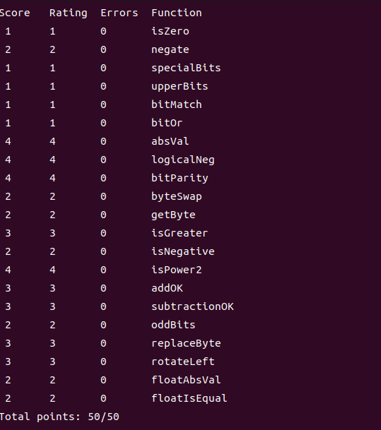

# 实验环境
虚拟机:VMware Workstation17

系统镜像: ubuntu-22.04.4-desktop-amd64.iso

GCC环境(gcc version):gcc (Ubuntu 11.4.0-1ubuntu1~22.04) 11.4.0

vim版本 8.2.2121

实验包:datalab-handout.tar

# 实验准备
下载实验包 : datalab-handout.tar

对实验包进行解压


解压命令解析:
```
tar -xvf datalab-handout.tar
-xvf 
x – 解压文件
v – 显示进度
f – 文件名
后面接着的是需要解压文件(压缩包)的名字
```

通过阅读解压后的README文件可知本次实验的目的和流程
## README
Your goal is to modify your copy of bits.c so that it passes all the
tests in btest without violating any of the coding guidelines.

你的目标是修改bits.c的副本，使其通过所有
在btest中进行测试，而不违反任何编码准则。
### step 0
0.Files:
```
Makefile - Makes btest, fshow, and ishow
README - This file
bits.c - The file you will be modifying and handing in
bits.h - Header file
btest.c - The main btest program
btest.h - Used to build btest
decl.c - Used to build btest
tests.c       - Used to build btest
tests-header.c- Used to build btest
dlc* - Rule checking compiler binary (data lab compiler)  
driver.pl* - Driver program that uses btest and dlc to autograde bits.c
Driverhdrs.pm   - Header file for optional "Beat the Prof" contest
fshow.c - Utility for examining floating-point representations
ishow.c - Utility for examining integer representations
```
```
Makefile-制作btest、fshow和ishow
README-此文件
bits.c-您将要修改和提交的文件
bits.h-头文件
btest.c-主要的btest程序
btest.h-用于构建btest
decl.c-用于构建btest
tests.c-用于构建btest
tests header.c-用于构建btest
dlc*-规则检查编译器二进制文件（数据实验室编译器）
driver.pl*-使用btest和dlc对bits.c进行自动编码的驱动程序
Driverhdrs.pm-可选“击败教授”比赛的头文件
fshow.c-用于检查浮点表示的实用程序
ishow.c-用于检查整数表示的实用程序
```

### step1

1.Modifying bits.c and checking it for compliance with dlc
1.修改bits.c并检查其是否符合dlc

Use the dlc compiler (./dlc) to automatically check your version of
bits.c for compliance with the coding guidelines:

使用dlc编译器（./dlc）自动检查您的版本
bits.c符合编码准则：

``unix> ./dlc bits.c``

dlc returns silently if there are no problems with your code.

如果您的代码没有问题，dlc将静默返回。


Otherwise it prints messages that flag any problems.  Running dlc with
the -e switch:

否则，它将打印标记任何问题的消息。使用运行dlc
-e开关：

``unix> ./dlc -e bits.c  ``

causes dlc to print counts of the number of operators used by each function.

使dlc打印每个函数使用的运算符数量的计数。


上图就是显示了在每个函数运算符的使用统计，因为现在还没开始实验，也就没修改bits.c文件，使用运算符全为0是正常现象

### Step2
2.Testing with btest

The Makefile in this directory compiles your version of bits.c with
additional code to create a program (or test harness) named btest.

To compile and run the btest program, type:

此目录中的Makefile使用以下代码编译您的bits.c版本
创建名为btest的程序（或测试工具）的附加代码。
要编译并运行btest程序，请键入：

```
make btest

./btest [optional cmd line args]
```

You will need to recompile btest each time you change your bits.c
program. When moving from one platform to another, you will want to
get rid of the old version of btest and generate a new one.  Use the
commands:

每次更改bits时，都需要重新编译btest。c
程序。从一个平台移动到另一个平台时，您会希望
删除旧版本的btest并生成一个新版本。使用
命令：

```
make clean

make btest
```

Btest tests your code for correctness by running millions of test
cases on each function.  It tests wide swaths around well known corner
cases such as Tmin and zero for integer puzzles, and zero, inf, and
the boundary between denormalized and normalized numbers for floating
point puzzles. When btest detects an error in one of your functions,
it prints out the test that failed, the incorrect result, and the
expected result, and then terminates the testing for that function.

Btest通过运行数百万个测试来**测试代码的正确性
每个功能的案例**。它测试了著名拐角周围的大片区域
整数谜题的Tmin和zero，以及zero、inf和
浮点数的非规范化数与规范化数的边界
点谜题。当btest检测到您的某个函数中有错误时，
它打印出失败的测试、不正确的结果和
然后终止对该函数的测试

Here are the command line options for btest:
以下是btest的命令行选项：

```
unix> ./btest -h
Usage: ./btest [-hg] [-r <n>] [-f <name> [-1|-2|-3 <val>]*] [-T <time limit>]
-1 <val>  Specify first function argument
-2 <val>  Specify second function argument
-3 <val>  Specify third function argument
-f <name> Test only the named function
-g        Format output for autograding with no error messages
-h        Print this message
-r <n>    Give uniform weight of n for all problems
-T <lim>  Set timeout limit to lim
```

```
unix> ./btest -h

用法：./btest [-hg] [-r <n>] [-f <name> [-1|-2|-3 <val>]*] [-T <time limit>]

-1 <val>  指定第一个函数参数

-2 <val>  指定第二个函数参数

-3 <val>  指定第三个函数参数

-f <name>  仅测试指定名称的函数

-g        格式化输出以便于自动评分，不显示错误信息

-h        打印此消息

-r <n>    为所有问题赋予均匀权重 n

-T <lim>  设置超时时限为 lim
```

Examples:
示例：

Test all functions for correctness and print out error messages:
测试所有功能的正确性，并打印出错误消息：

``./btest``


Test all functions in a compact form with no error messages:
以紧凑的形式测试所有功能，没有错误消息：
``./btest -g``

Test function foo for correctness:
测试函数foo的正确性：
``./btest -f foo``

Test function foo for correctness with specific arguments:
使用特定参数测试函数foo的正确性：
``./btest -f foo -1 27 -2 0xf``

Btest does not check your code for compliance with the coding
guidelines.  Use dlc to do that.
Btest不会检查您的代码是否符合编码
指导方针。使用dlc来实现这一点。
### Step3
3.Helper Programs
我们包含了 ishow 和 fshow 程序，以帮助您分别解读整数和浮点数的表示。每个程序接受一个十进制或十六进制数字作为参数。要构建它们，请输入：
``make``

示例用法：

```
unix> ./ishow 0x27
十六进制 = 0x00000027, 有符号 = 39, 无符号 = 39

unix> ./ishow 27
十六进制 = 0x0000001b, 有符号 = 27, 无符号 = 27

unix> ./fshow 0x15213243
浮点值 3.255334057e-26
位表示 0x15213243, 符号 = 0, 指数 = 0x2a, 尾数 = 0x213243
标准化. +1.2593463659 X 2^(-85)

linux> ./fshow 15213243
浮点值 2.131829405e-38
位表示 0x00e822bb, 符号 = 0, 指数 = 0x01, 尾数 = 0x6822bb
标准化. +1.8135598898 X 2^(-126)

```
## bits.c
注意阅读上面的提示，有禁用规则等...
```c
/* 
 * CS:APP 数据实验室 
 * 
 * <请在此处填写你的姓名和用户名>
 * 
 * bits.c - 你的实验解决方案的源文件。
 *          这是你将提交给你的老师的文件。
 *
 * 警告：请勿包含 <stdio.h> 头文件；这会导致 dlc
 * 编译器混淆。你仍然可以在不包含 <stdio.h> 的情况下使用 printf 进行调试，
 * 尽管你可能会收到编译器警告。一般来说，忽略编译器警告不是好的做法，
 * 但在这种情况下是可以的。  
 */

/*
 * 学生说明：
 *
 * 第一步：仔细阅读以下说明。
 */

你将通过编辑这个源文件中的函数集合来提供你的数据实验室解决方案。

整数编码规则：

将每个函数中的 "return" 语句替换为一行或多行实现该函数的 C 代码。你的代码必须符合以下风格：

int Funct(arg1, arg2, ...) {
    /* 简要描述你的实现如何工作 */
    int var1 = Expr1;
    ...
    int varM = ExprM;

    varJ = ExprJ;
    ...
    varN = ExprN;
    return ExprR;
}

每个 "Expr" 仅可以使用以下内容：
1. 整数常量 0 到 255（0xFF），包括在内。你不能使用大常量，如 0xffffffff。
2. 函数参数和局部变量（不允许使用全局变量）。
3. 一元整数运算符 ! ~
4. 二元整数运算符 & ^ | + << >>

某些问题进一步限制了允许的运算符集。每个 "Expr" 可以由多个运算符组成。你不限制每行只能有一个运算符。

你被明确禁止：
1. 使用任何控制结构，例如 if、do、while、for、switch 等。
2. 定义或使用任何宏。
3. 在此文件中定义任何其他函数。
4. 调用任何函数。
5. 使用任何其他操作，如 &&、||、- 或 ?:。
6. 使用任何形式的类型转换。
7. 使用除 int 之外的任何数据类型。这意味着你不能使用数组、结构或联合。

你可以假设你的机器：
1. 使用 2 的补码，32 位整数表示法。
2. 算术右移。
3. 当移位量小于 0 或大于 31 时，具有不可预测的行为。

以下是可接受的编码风格示例：
  /*
   * pow2plus1 - returns 2^x + 1, where 0 <= x <= 31
   */
  int pow2plus1(int x) {
     /* exploit ability of shifts to compute powers of 2 */
     return (1 << x) + 1;
  }

  /*
   * pow2plus4 - returns 2^x + 4, where 0 <= x <= 31
   */
  int pow2plus4(int x) {
     /* exploit ability of shifts to compute powers of 2 */
     int result = (1 << x);
     result += 4;
     return result;
  }

浮点编码规则：
对于需要您实现浮点操作的问题，编码规则相对宽松。您可以使用循环和条件控制。您可以使用整数和无符号整数。您可以使用任意整数和无符号常量。您可以对整数或无符号数据进行任何算术、逻辑或比较操作。

您明确禁止：

定义或使用任何宏。
在此文件中定义任何额外的函数。
调用任何函数。
使用任何形式的类型转换。
使用除整数或无符号外的任何数据类型。这意味着您不能使用数组、结构体或联合体。
使用任何浮点数据类型、操作或常量。

注意事项：

使用 dlc（数据实验检查器）编译器（在手册中描述）来检查您解决方案的合法性。
每个函数都有一个最大操作数（整数、逻辑或比较），这是您在实现该函数时允许使用的。最大操作数由 dlc 检查。请注意，赋值（'='）不计入操作数；您可以随意使用这些而不受惩罚。
使用 btest 测试工具检查您的函数是否正确。
使用 BDD 检查器正式验证您的函数。
每个函数的最大操作数在每个函数的头部注释中给出。如果写作和此文件中的最大操作数之间存在任何不一致，请将此文件视为权威来源。

第2步：根据编码规则修改以下函数。
重要提示：为了避免评分时的意外：
使用 dlc 编译器检查您的解决方案是否符合编码规则。
使用 BDD 检查器正式验证您的解决方案是否产生正确的答案。

```

往下看基本上没啥好看的了，仅仅需要注意到
```
We do not support C11 <threads.h>. 
```
不支持头文件``<threads.h>``

## 简洁版本  bits.c
不能定义和使用宏
不能定义和使用函数
允许的运算有
```
一元整数运算符 ! ~
二元整数运算符 & ^ | + << >>
```
禁止分支，循环语句。
不能使用数组、结构或联合
只能使用int类型变量
禁止任何形式的类型转换
使用数字范围是整数常量 0 到 255（0xFF），包括在内。
可以使用函数参数和局部变量

# 开始实验
## isZero
未修改前:
```c
/*
 * isZero - returns 1 if x == 0, and 0 otherwise 
 *   Examples: isZero(5) = 0, isZero(0) = 1
 *   Legal ops: ! ~ & ^ | + << >>
 *   Max ops: 2
 *   Rating: 1
 */
int isZero(int x) {
  return 2;
}
```
题目意思是完成函数``isZero()``使得传入0返回1，否则返回0
这题考的是非0则1
修改后：
```c
/*
 * isZero - returns 1 if x == 0, and 0 otherwise 
 *   Examples: isZero(5) = 0, isZero(0) = 1
 *   Legal ops: ! ~ & ^ | + << >>
 *   Max ops: 2
 *   Rating: 1
 */
int isZero(int x) {
  return !x;
}
```
## negate
未修改前:
```c
/* 
 * negate - return -x 
 *   Example: negate(1) = -1.
 *   Legal ops: ! ~ & ^ | + << >>
 *   Max ops: 5
 *   Rating: 2
 */
int negate(int x) {
  return 2;
}
```
题目意思是返回传入的相反数
Max ops(最大允许操作符个数)5个
首先考虑一下相反数的特性(二进制下)，
```
eg.
1 (0001)  -1 (1111)
2 (0010)  -2 (1110)
3 (0011)  -3 (1101)
4 (0100)  -4 (1100)
5 (0101)  -5 (1011)
6 (0110)  -6 (1010)
```
找出规律是一种做题办法
第二种:
根据负数补码运算
负数的补码：
首先找到该数的原码（即正常的二进制表示）。
然后对所有位取反（0变1，1变0）。
最后在结果上加1。
得到答案(可以按照上面例子进行检验)
修改后:
```c
/* 
 * negate - return -x 
 *   Example: negate(1) = -1.
 *   Legal ops: ! ~ & ^ | + << >>
 *   Max ops: 5
 *   Rating: 2
 */
int negate(int x) {
  return (~x) + 1;
}
```

还可以单独检验一下答案是否正确;


## specialBits
```c
/* 
 * specialBits - return bit pattern 0xffca3fff
 *   Legal ops: ! ~ & ^ | + << >>
 *   Max ops: 3
 *   Rating: 1
 */
int specialBits(void) {
    return 2;
}
```
这道题就是说要你返回值为``0xffca3fff``
```c
int specialBits(void) {
    return ~(((0x35)<<16) | ((0xc0)<<8));
}
```
首先有个很简单的处理思路
先把 ``0xca``取反后用右移放到对应位置
再把 ``0x3f``取反后用右移放到对应位置
最后用按位或进行拼接后整个取反就能得到答案
但问题是这种做法用了4个操作符，要求是3个操作符
最外层的取反暂时没用想法能去掉，那么里面能不能合并是一条路子。

观察到``0xca``和``0x3f``是在一起的，如果能直接得到``~0xca3f``然后将其位移到合适位置也可以
``~0xca3f = 0x35c0 (0011 0101 1100 0000)``
从二进制的角度，实际上我们只需要将有1的地方表示出来即可，发现完全包含所有1的字串``11 0101 11``长度为8，恰好在允许表示范围内
整理该字串得到``0xD7 (1101 0111)``

答案就变成了
```c
/* 
 * specialBits - return bit pattern 0xffca3fff
 *   Legal ops: ! ~ & ^ | + << >>
 *   Max ops: 3
 *   Rating: 1
 */
int specialBits(void) {
    return ~(0xD7 << 14);
}
```
输入指令``./btest -f specialBits``测试发现是对的

## upperBits
```c
/* 
 * upperBits - pads n upper bits with 1's
 *  You may assume 0 <= n <= 32
 *  Example: upperBits(4) = 0xF0000000
 *  Legal ops: ! ~ & ^ | + << >>
 *  Max ops: 10
 *  Rating: 1
 */
int upperBits(int n) {
  return ((!!n)<<31)>>(n + (~0));
}
```
用 1 填充 n 个高位
意思是返回值的最高的 n 位都是 1
由于不能使用减法，也没说允许使用 ``sizeof(int)``,这里尽量先不用

这里思路是既然无法精准的定位和位移，那么先将其取反
题目就变成了最高的 n 位都是 0，其他位都是1

题目明确说了
你可以假设你的机器：
1. 使用 2 的补码，32 位整数表示法。
2. 算术右移。

这里的思路是先把最高位变为 1 if x > 0, and 0 otherwise
就可以借鉴第一个函数的思路写出``!!n``，然后将其位移到最高位。

最后通过算数右移补充最高位，需要右移$(n-1)$,因为不能使用减法，所以使用 n + (-1)即``n + (~0)``的操作完成。

## bitMatch
```c
/* 
 * bitMatch - Create mask indicating which bits in x match those in y
 *            using only ~ and & 
 *   Example: bitMatch(0x7, 0xE) = 0x6
 *   Legal ops: ~ & |
 *   Max ops: 14
 *   Rating: 1
 */
int bitMatch(int x, int y) {
  return ~(((~x)&y) | ((~y)&x));
}
```
题目意思是创建一个掩码，指示 x 中哪些位与 y 中的位匹配
样例给的是
``0x7(0111) 0xE(1110)``
第二三位匹配，所以答案是``(0110) 0x6``

书本上练习题2.13 很类似(甚至就是拓展题)，我在解析该题的时候用到的方法和这题类似
都是使用真值表进行的，这里可以阅读我当时的做法，自行去推即可


## bitOr
```c
/* 
 * bitOr - x|y using only ~ and & 
 *   Example: bitOr(6, 5) = 7
 *   Legal ops: ~ &
 *   Max ops: 8
 *   Rating: 1
 */
int bitOr(int x, int y) {
  return ~(~x & ~y);
}
```
书本上练习题2.13 很类似，我在解析该题的时候用到的方法和这题类似
都是使用真值表进行的，这里可以阅读我当时的做法，自行去推即可

## absVal
```c
/* 
 * absVal - absolute value of x
 *   Example: absVal(-1) = 1.
 *   You may assume -TMax <= x <= TMax
 *   Legal ops: ! ~ & ^ | + << >>
 *   Max ops: 10
 *   Rating: 4
 */
int absVal(int x) {
  int mask = x >> 31;
  return (x+mask)^mask;
}
```
题目要求返回 x 的绝对值！

通过上面函数可得
```c
int negate(int x) {
  return (~x) + 1;
}
```
如果是负数，直接套用就可以得到相反数，问题是还有正数。
负数的补码 $-n$是将 $n$ 的二进制取反+1得到的
``-n = ~n + 1``

又知道 ``n^(-1) == ~n``
``-n = (n^(-1)) + 1``
`` (-n - 1) = ~n ``
将两边同时取反可得 ``~(-n-1) = ~~n = n``
相当于说``~(-n+(-1)) = n``

通过上面实验可以想到 ``-1``可以由最高位是1的数字通过算数右移得到答案。
所以自然``int mask = x >> 31`` ， 如果是正数 mask = 0 否则为 -1

而恰好``n^(-1) == ~n``而``n^0 = n``
所以答案可以是``(x + mask)^mask``

## logicalNeg
```c
/* 
 * logicalNeg - implement the ! operator, using all of 
 *              the legal operators except !
 *   Examples: logicalNeg(3) = 0, logicalNeg(0) = 1
 *   Legal ops: ~ & ^ | + << >>
 *   Max ops: 12
 *   Rating: 4 
 */
int logicalNeg(int x) {
  int mask = x >> 31;
  int x1 = (x+mask)^mask;
  int xf = (~x1)+1;
  return (xf>>31) + 1;
}
```

本题意思是不用逻辑非，实现其功能。

正难则反
如果能把非0数表示为 1 ， 0还是表示为0，对答案取反即可。

想到如果传入的 x 能保证如果非0最高位是 1 那么就好办了

这里还考虑到0的情况，就有一个路子是 先取 x 的绝对值 ， 然后计算 x 的相反数。就能保证每一个传进来的 非0 x 最后都变为负数，而0还是为0

绝对值:
```c
int absVal(int x) {
  int mask = x >> 31;
  return (x+mask)^mask;
}
```

相反数:
```c
int negate(int x) {
  return (~x) + 1;
}
```

结合一下：
```c
int mask = x >> 31;
int x1 = (x+mask)^mask;
int xf = (~x1)+1;
```
到这一步后 非0 x 处理后的 xf 最高位都肯定是1

如果将其算数右移31位，答案肯定是-1.

如果传入x是0，经过这几步答案肯定还是0

发现，将结果+1，就是本题的答案了！


## bitParity
```c
/*
 * bitParity - returns 1 if x contains an odd number of 0's
 *   Examples: bitParity(5) = 0, bitParity(7) = 1
 *   Legal ops: ! ~ & ^ | + << >>
 *   Max ops: 20
 *   Rating: 4
 */
int bitParity(int x) {
  int x16 = x^(x<<16);
  int x8 = x16^(x16<<8);
  int x4 = x8^(x8<<4);
  int x2 = x4^(x4<<2);
  int x1 = x2^(x2<<1);
  return !!(x1>>31);
}
```
本题意思是二进制位上有奇数个 0 那么就返回 1 ， 否则返回 0

根据二进制形式的观察，如果有奇数个0，那么1肯定也有奇数个。

因为有32位，而最大允许操作符个数只有20，所以单纯的一位一位的判断是不可能的了。

唯一和奇偶性质联系的上的按位操作符只有 按位异或。
如果多个数字按位异或，出现奇数个1，那么答案就是1，否则是0

那么如何有效的将二进制串“竖起来”计算呢？

这里使用折半异或的方式

每次将二进制串分为两段，前半段异或后半段，结果肯定是原来的二进制串的一半。
重复上述操作，直到二进制串只有一位。

剩下的就是答案，不过最后注意对答案的处理。

## byteSwap
```c
/* 
 * byteSwap - swaps the nth byte and the mth byte
 *  Examples: byteSwap(0x12345678, 1, 3) = 0x56341278
 *            byteSwap(0xDEADBEEF, 0, 2) = 0xDEEFBEAD
 *  You may assume that 0 <= n <= 3, 0 <= m <= 3
 *  Legal ops: ! ~ & ^ | + << >>
 *  Max ops: 25
 *  Rating: 2
 */
int byteSwap(int x, int n, int m) {
    int xn = x>>(n<<3);
    int xm = x>>(m<<3);
    x = (x&(~(((~xn)&0xFF)<<(m<<3)))) | (((xn&0xFF)<<(m<<3)));
    x = (x&(~(((~xm)&0xFF)<<(n<<3)))) | (((xm&0xFF)<<(n<<3)));
    return x;
}
```

本题意思是将第n个字节和第m个字节互换
样例给的 ``byteSwap(0x12345678 , 1 , 3)`` 就是把第一三个字节互换
也就是``0x56``和``0x12``互换即可。
通过样例也可知整个32位被分为4个字节并且是从0号开始编号

这里的思路是
首先提取第n个字节和第m个字节，对应上面的``xn和xm``

接着利用按位且的特性：将原来位上是1，但互换后那一位不是1的地方变为0
接着再用按位或将其填充。

用一个字节来解释就是：
``(a & b) | b = b``
``(a & 0xFF) | 0x0 = a``

所以我们需要构造一个位移到对应位子的字节，并且将其他地方都变为0和1各一次。

按照样例来讲就是需要得到``0x56000000 , 0x56111111 , 0x00001200 , 0x11111211``这四个数
然后通过计算
``(0x12345678 & 0x56111111) | 0x56000000 = 0x56345678``
``(0x56345678 & 0x11111211) | 0x00001200 = 0x56341278``

答案就出来了。

具体操作中间利用了且上``0xFF``去去掉前面字节不确定位。
相当于说``xn = x>>(n<<3)``，提取到最低位后前面高位字节的二进制串是不确定的。
按位且上``0xFF``后就肯定变为了``000000xn``

这样为后续操作提供了便利

## getByte
```c
/* 
 * getByte - Extract byte n from word x
 *   Bytes numbered from 0 (least significant) to 3 (most significant)
 *   Examples: getByte(0x12345678,1) = 0x56
 *   Legal ops: ! ~ & ^ | + << >>
 *   Max ops: 6
 *   Rating: 2
 */
int getByte(int x, int n) {
  return x>>(n<<3) & 0xFF;
}
```
这题需要你提取出第 n 个字节

这道题...按理来说应该放在上一道题前面。

这里不过多讲解了，解析在上题。


## isGreater
```c
/* 
 * isGreater - if x > y  then return 1, else return 0 
 *   Example: isGreater(4,5) = 0, isGreater(5,4) = 1
 *   Legal ops: ! ~ & ^ | + << >>
 *   Max ops: 24
 *   Rating: 3
 */
int isGreater(int x, int y) {
  int ysubx = y + (~x+1);
  int xsin = x>>31 & 0x1;
  int ysin = y>>31 & 0x1;
  int ysxsin = ysubx >> 31 & 0x1;
  return !!(x^y) & (!(xsin^ysin) | !xsin) & ((xsin ^ ysin) | ysxsin);
}
```
本题意思是判断 x 是否(严格)大于 y ， 如果成立返回 1 ， 否则返回 0


一般判断大小的思想是相减，然后判断是否大于零或者小于零...

如果把``x^y``就可以得到x和y不一样的位在哪里。

也就是说``x^y``可以判断是否相同

如果相同返回 0 ， 否则返回 其他数

所以第一个式子就是``!!(x ^ y)``

设 xsin 为 x 的符号位 ， ysin 为 y 的符号位

如果 x 和 y 符号不同，可以直接判断。``!(xsin^ysin) | !xsin``

这里采用了类似真值表的思考方式

我们需要x 和 y 符号相同的时候返回1 ， 否则返回 0/1
先处理前面 ， ``xsin^ysin``在符号相同会返回 0 ， 将其取反 ，**后面跟着按位或**，本式就成立。

符号不同时候，x为正，就x非负。符号位为0 ，  或上 ``!xsin``
这时候如果x , y 符号位不同且x为负，带入可得本式取得 0 ，符合情形。

再通过``x - y = x + (-y) = x + (~y+1)``计算x - y
如果x > y ， x - y > 0 , 判断符号位应该是 0 , 为了少用一个取反符号，我们可以变成 y - x

现在问题就变为溢出如何处理。

如果两个异号才会出现溢出。

所以就和上面的反过来

异号在相减变同号，所以同号相减变异号，x，y同号返回 0 ， 异号返回 1 
相当于 异号 可能会溢出，这里判断不了，直接给了。

如果是 同好， 直接判断是否 y - x < 0 即可，即 符号位为 1 返回 1  ，符号位 0 返回 0 。
所以按位或上符号位即可

``(xsin ^ ysin) | ysxsin ``


## isNegative
```c
/* 
 * isNegative - return 1 if x < 0, return 0 otherwise 
 *   Example: isNegative(-1) = 1.
 *   Legal ops: ! ~ & ^ | + << >>
 *   Max ops: 6
 *   Rating: 2
 */
int isNegative(int x) {
  return !!(x>>31);
}
```
题目意思是如果x小于0返回1，否则返回0

思路就很简单了，判断最高位是否是1即可。

这里的思路是因为是算数右移，补充最高位，所以右移31位，如果是正数那么右移完肯定是0

两次取反是为了负数最后返回值是1
## isPower2
```c
/*
 * isPower2 - returns 1 if x is a power of 2, and 0 otherwise
 *   Examples: isPower2(5) = 0, isPower2(8) = 1, isPower2(0) = 0
 *   Note that no negative number is a power of 2.
 *   Legal ops: ! ~ & ^ | + << >>
 *   Max ops: 20
 *   Rating: 4
 */
int isPower2(int x) {
  return (!(x&(x-1))) & (!(x>>31)) & !!x;
}
```

这个做题的思路就在于如果是2的幂，那么二进制里面只会出现一个1

如果把这个1减去，也就是``x&(x-1)``，如果结果为0那么肯定是2的幂

易错点就在没去判断负数不是二的幂
上面一题判断了什么是负数，直接拿过来用即可

还有易错的地方就是 0 ，0不是二的幂 ， 所以后面跟上``!!x``就可以完成判断

## addOK

```c
/* 
 * addOK - Determine if can compute x+y without overflow
 *   Example: addOK(0x80000000,0x80000000) = 0,
 *            addOK(0x80000000,0x70000000) = 1, 
 *   Legal ops: ! ~ & ^ | + << >>
 *   Max ops: 20
 *   Rating: 3
 */
int addOK(int x, int y) {
  int xsin = x>>31 & 0x1;
  int ysin = y>>31 & 0x1;
  int xy = x+y;
  int xysin = xy>>31 & 0x1;
  return (xsin^ysin) | !(!(xsin ^ ysin) & ((xysin^xsin) | !xy)) | (!x & !y);
}
```
这题题意是判断 x+y 是否溢出 ， 没有溢出返回 1 ， 否则返回 0

在书本上我们学习了溢出分为下溢和上溢

首先确认一点 ， 同号好相加才可能溢出

所以我们可以先把异号不会溢出写出来
```c
  int xsin = x>>31 & 0x1;
  int ysin = y>>31 & 0x1;
  return (xsin^ysin) | ;
```
现在就是异号肯定返回 1 ， 同号返回 0(未定)

回顾一下上溢 ： 两个正数相加 ， 出现了 负数 或 0
回顾一下下溢 ： 两个负数相加 ， 出现了 正数 或 0

实际上就是如果 x , y 符号相同``!(xsin ^ ysin) & `` 且 (x 和 x+y 的符号不同 **或** x+y == 0)那肯定溢出了。

对溢出判断取反就是没溢出的判断了。

最后测试了发现 ``x==0 && y==0`` 的情况出现纰漏,附加``| (!x & !y)``进行特判即可。

## subtractionOK

```c
/* 
 * subtractionOK - Determine if can compute x-y without overflow
 *   Example: subtractionOK(0x80000000,0x80000000) = 1,
 *            subtractionOK(0x80000000,0x70000000) = 0, 
 *   Legal ops: ! ~ & ^ | + << >>
 *   Max ops: 20
 *   Rating: 3
 */
int subtractionOK(int x, int y) {
  int xsin = x>>31 & 0x1;
  int ysin = y>>31 & 0x1;
  int xy = x+(~y+1);
  int xysin = xy>>31 & 0x1;
  return !(xsin^ysin) | !((xsin ^ ysin) & ((xysin^xsin) | !xy)) | (!x & !y);
}
```
本题题意是 判断 x - y 是否溢出

这里和上题的判断 x + y 是否溢出很类似。
我们仅需要将 ``xy=x+y``改为``xy = x - y`` 然后符号判断改一下即可，但问题是超出了操作符限制。

我们又注意到后面有关``xsin , ysin , xysin``的操作前面都有 非操作 ， 所以不需要按位且上 0x1 将其保留了。 

答案就变成了:
```c
int subtractionOK(int x, int y) {
  int xsin = x>>31 ;
  int ysin = y>>31 ;
  int xy = x+(~y+1);
  int xysin = xy>>31 ;
  return !(xsin^ysin) | !((xsin ^ ysin) & ((xysin^xsin) | !xy)) | (!x & !y);
}
```

## oddBits

```c
/* 
 * oddBits - return word with all odd-numbered bits set to 1
 *   Legal ops: ! ~ & ^ | + << >>
 *   Max ops: 8
 *   Rating: 2
 */
int oddBits(void) {
  return 0xAA | 0xAA<<8 | 0xAA<<16 | 0xAA<<24;;
}
```
这道题意思是将偶数位都设为1，返回该值

二进制串最低字节的偶数位为1 是 ``1010 1010 (0xAA)``
32位有 4 个字节，将其位移到每一字节上再 按位或即可

``0xAA | 0xAA<<8 | 0xAA<<16 | 0xAA<<24``

## replaceByte

```c
/* 
 * replaceByte(x,n,c) - Replace byte n in x with c
 *   Bytes numbered from 0 (LSB) to 3 (MSB)
 *   Examples: replaceByte(0x12345678,1,0xab) = 0x1234ab78
 *   You can assume 0 <= n <= 3 and 0 <= c <= 255
 *   Legal ops: ! ~ & ^ | + << >>
 *   Max ops: 10
 *   Rating: 3
 */
int replaceByte(int x, int n, int c) {
  int maskc = c<<(n<<3);
  int mask = 0xFF << (n<<3);
  return x & ~mask | maskc;
}
```
本题题意: 用 c 替换 x 中的第 n 个字节

这道题其实答案在 byteSwap 里面

核心就是构造出 **除了第n个字节是 0 其他字节都是 0xFF 的二进制串**

## rotateLeft

```c
/* 
 * rotateLeft - Rotate x to the left by n
 *   Can assume that 0 <= n <= 31
 *   Examples: rotateLeft(0x87654321,4) = 0x76543218
 *   Legal ops: ~ & ^ | + << >> !
 *   Max ops: 25
 *   Rating: 3 
 */
int rotateLeft(int x, int n) {
  return (x<<n) | ((x>>(32 + (~n+1))) & ~((~0)<<n));
}
```
本题意思是将二进制串  x 向左位移(旋转) n 位。

可以看成首尾相连的环，就能理解了。

首先先将 x 左移 n 位 。 最低位补 0 ， 这时候将 x 的 最高 n 位 移到最低位补齐即可。

``x << n`` , ``x>> (32 - n) == x >> (32 + (~n+1))`` , ``x<<n | x>>(32 + (~n+1))``

到这一步依旧出现了类似写byteSwap的问题。也就说 按位或 ， 如果最高位是  1，这么一操作 ``| x>>(32 + (~n+1))`` ， 直接将前面的高位全变为 1了，答案肯定错。

这时候我们就需要将其只保留我们需要的部分，根据按位或的性质，将``x>>(32 + (~n+1))``且上``000000011111``之类的，后面的 1 是我们需要的，前面的 0 是不能动的位。

先且上最后或上的答案才对。

那么问题就变为如何构造这后边 32 - n位的1？

将其取反，因为高位连续 1 很容易得到，所以我们采用取反操作。
``11111111 0000``， 1 的个数其实就是 32-n  ， 那最高的 32 - n 位是要保留的。
所以可以由 (-1) << n , 将其构造出来。答案就出来了。

## floatAbsVal
```c
/* 
 * floatAbsVal - Return bit-level equivalent of absolute value of f for
 *   floating point argument f.
 *   Both the argument and result are passed as unsigned int's, but
 *   they are to be interpreted as the bit-level representations of
 *   single-precision floating point values.
 *   When argument is NaN, return argument..
 *   Legal ops: Any integer/unsigned operations incl. ||, &&. also if, while
 *   Max ops: 10
 *   Rating: 2
 */
 /* 
 * floatAbsVal - 返回浮点数 f 的绝对值的位级等效表示。
 *   参数和结果都作为无符号整数传递，但它们应被解释为单精度浮点值的位级表示。
 *   当参数为 NaN 时，返回参数本身。
 *   合法操作：任何整数/无符号运算，包括 ||、&&，还可以使用 if、while。
 *   最大操作数：10
 *   评级：2
 */
unsigned floatAbsVal(unsigned uf) {
  int mask = ~(0x1 << 31);
  int x = uf & mask;
  if(x > 0x7f800000)
    return uf;
  return x;
}
```

浮点数 IEEE  的表示方式 是 最高位为符号位 s ， 负数(s=1)和正数(s=0)

取绝对值只要把符号位置为0

最后判断一下 NAN .
书本原话(节选) ：

情况 3:特殊值
**最后一类数值是当指阶码全为1的时候出现的。当小数域为非零时，结果值被称为“NaN”**

所以如果值大于 ``0x7f800000`` 那么就肯定为 NAN ， 返回本身即可。

否则将符号位变为0 ， 即按位且上 ``0x7fffffff``

## floatIsEqual
```c
/* 
 * floatIsEqual - Compute f == g for floating point arguments f and g.
 *   Both the arguments are passed as unsigned int's, but
 *   they are to be interpreted as the bit-level representations of
 *   single-precision floating point values.
 *   If either argument is NaN, return 0.
 *   +0 and -0 are considered equal.
 *   Legal ops: Any integer/unsigned operations incl. ||, &&. also if, while
 *   Max ops: 25
 *   Rating: 2
 */
 /* 
 * floatIsEqual - 计算浮点数参数 f 和 g 是否相等 (f == g)。
 *   参数都作为无符号整数传递，但应被解释为单精度浮点值的位级表示。
 *   如果任一参数为 NaN，则返回 0。
 *   +0 和 -0 被视为相等。
 *   合法操作：任何整数/无符号运算，包括 ||、&&，还可以使用 if、while。
 *   最大操作数：25
 *   评级：2
 */
int floatIsEqual(unsigned uf, unsigned ug) {
    int mask = ~(0x1 << 31);
    int mask2 = 0xFF << 23;
    int x = uf & mask;
    int y = ug & mask;
    if(x > mask2 || y > mask2)return 0;
    if(!x && !y)return 1;
    return uf == ug;
}
```
本题题意就是判断两个浮点数是否相同。

只需要注意NAN 和 -0/+0 这特殊情况。

-0 / +0 判断在
```c
if(!x && !y)return 1;
```
核心就是 这样表示 都是 0

## 最后整体判断



# 错误处理
## 错误1:make btest出错

运行指令：
```
make btest
```
报错提示：
```
In file included from btest.c:16:
/usr/include/stdio.h:27:10: fatal error: bits/libc-header-start.h: No such file or directory
   27 | #include <bits/libc-header-start.h>
      |          ^~~~~~~~~~~~~~~~~~~~~~~~~~
compilation terminated.

```

**错误原因**：出现这个错误时，这多半是你所编译的项目是在64位机器上生成32位的项目

**错误解决:**
需要安装对应的gcc 32位的库；此时检查gcc一定有-m32的存在；

你系统中gcc没有安装multilib 库；使用这个库可以在64位的机器上产生32位的程序或者库文件；

你可以选择：``apt install gcc-multilib``进行完善安装；

如果运行``apt install gcc-multilib``提示无法打开 锁什么的可以运行
``sudo apt install gcc-multilib``
实际上是权限不够的问题