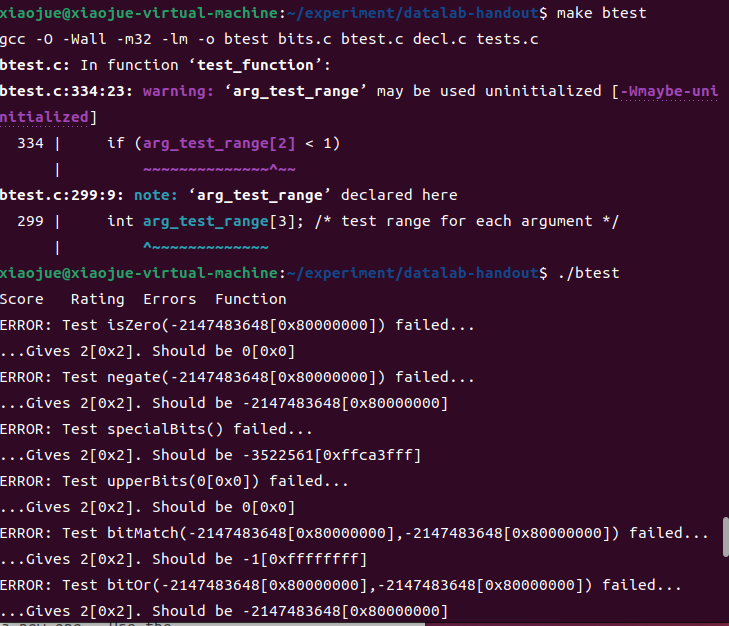

# 实验环境
虚拟机:VMware Workstation17

系统镜像: ubuntu-22.04.4-desktop-amd64.iso

GCC环境(gcc version):gcc (Ubuntu 11.4.0-1ubuntu1~22.04) 11.4.0

vim版本 8.2.2121

实验包:datalab-handout.tar

# 实验准备
下载实验包 : datalab-handout.tar

对实验包进行解压


解压命令解析:
```
tar -xvf datalab-handout.tar
-xvf 
x – 解压文件
v – 显示进度
f – 文件名
后面接着的是需要解压文件(压缩包)的名字
```

通过阅读解压后的README文件可知本次实验的目的和流程
## README
Your goal is to modify your copy of bits.c so that it passes all the
tests in btest without violating any of the coding guidelines.

你的目标是修改bits.c的副本，使其通过所有
在btest中进行测试，而不违反任何编码准则。
### step 0
0.Files:
```
Makefile - Makes btest, fshow, and ishow
README - This file
bits.c - The file you will be modifying and handing in
bits.h - Header file
btest.c - The main btest program
btest.h - Used to build btest
decl.c - Used to build btest
tests.c       - Used to build btest
tests-header.c- Used to build btest
dlc* - Rule checking compiler binary (data lab compiler)  
driver.pl* - Driver program that uses btest and dlc to autograde bits.c
Driverhdrs.pm   - Header file for optional "Beat the Prof" contest
fshow.c - Utility for examining floating-point representations
ishow.c - Utility for examining integer representations
```
```
Makefile-制作btest、fshow和ishow
README-此文件
bits.c-您将要修改和提交的文件
bits.h-头文件
btest.c-主要的btest程序
btest.h-用于构建btest
decl.c-用于构建btest
tests.c-用于构建btest
tests header.c-用于构建btest
dlc*-规则检查编译器二进制文件（数据实验室编译器）
driver.pl*-使用btest和dlc对bits.c进行自动编码的驱动程序
Driverhdrs.pm-可选“击败教授”比赛的头文件
fshow.c-用于检查浮点表示的实用程序
ishow.c-用于检查整数表示的实用程序
```

### step1

1.Modifying bits.c and checking it for compliance with dlc
1.修改bits.c并检查其是否符合dlc

Use the dlc compiler (./dlc) to automatically check your version of
bits.c for compliance with the coding guidelines:

使用dlc编译器（./dlc）自动检查您的版本
bits.c符合编码准则：

``unix> ./dlc bits.c``

dlc returns silently if there are no problems with your code.

如果您的代码没有问题，dlc将静默返回。


Otherwise it prints messages that flag any problems.  Running dlc with
the -e switch:

否则，它将打印标记任何问题的消息。使用运行dlc
-e开关：

``unix> ./dlc -e bits.c  ``

causes dlc to print counts of the number of operators used by each function.

使dlc打印每个函数使用的运算符数量的计数。


上图就是显示了在每个函数运算符的使用统计，因为现在还没开始实验，也就没修改bits.c文件，使用运算符全为0是正常现象

### Step2
2.Testing with btest

The Makefile in this directory compiles your version of bits.c with
additional code to create a program (or test harness) named btest.

To compile and run the btest program, type:

此目录中的Makefile使用以下代码编译您的bits.c版本
创建名为btest的程序（或测试工具）的附加代码。
要编译并运行btest程序，请键入：

```
make btest

./btest [optional cmd line args]
```

You will need to recompile btest each time you change your bits.c
program. When moving from one platform to another, you will want to
get rid of the old version of btest and generate a new one.  Use the
commands:

每次更改bits时，都需要重新编译btest。c
程序。从一个平台移动到另一个平台时，您会希望
删除旧版本的btest并生成一个新版本。使用
命令：

```
make clean

make btest
```

Btest tests your code for correctness by running millions of test
cases on each function.  It tests wide swaths around well known corner
cases such as Tmin and zero for integer puzzles, and zero, inf, and
the boundary between denormalized and normalized numbers for floating
point puzzles. When btest detects an error in one of your functions,
it prints out the test that failed, the incorrect result, and the
expected result, and then terminates the testing for that function.

Btest通过运行数百万个测试来**测试代码的正确性
每个功能的案例**。它测试了著名拐角周围的大片区域
整数谜题的Tmin和zero，以及zero、inf和
浮点数的非规范化数与规范化数的边界
点谜题。当btest检测到您的某个函数中有错误时，
它打印出失败的测试、不正确的结果和
然后终止对该函数的测试

Here are the command line options for btest:
以下是btest的命令行选项：

```
unix> ./btest -h
Usage: ./btest [-hg] [-r <n>] [-f <name> [-1|-2|-3 <val>]*] [-T <time limit>]
-1 <val>  Specify first function argument
-2 <val>  Specify second function argument
-3 <val>  Specify third function argument
-f <name> Test only the named function
-g        Format output for autograding with no error messages
-h        Print this message
-r <n>    Give uniform weight of n for all problems
-T <lim>  Set timeout limit to lim
```

```
unix> ./btest -h

用法：./btest [-hg] [-r <n>] [-f <name> [-1|-2|-3 <val>]*] [-T <time limit>]

-1 <val>  指定第一个函数参数

-2 <val>  指定第二个函数参数

-3 <val>  指定第三个函数参数

-f <name>  仅测试指定名称的函数

-g        格式化输出以便于自动评分，不显示错误信息

-h        打印此消息

-r <n>    为所有问题赋予均匀权重 n

-T <lim>  设置超时时限为 lim
```

Examples:
示例：

Test all functions for correctness and print out error messages:
测试所有功能的正确性，并打印出错误消息：

``./btest``


Test all functions in a compact form with no error messages:
以紧凑的形式测试所有功能，没有错误消息：
``./btest -g``

Test function foo for correctness:
测试函数foo的正确性：
``./btest -f foo``

Test function foo for correctness with specific arguments:
使用特定参数测试函数foo的正确性：
``./btest -f foo -1 27 -2 0xf``

Btest does not check your code for compliance with the coding
guidelines.  Use dlc to do that.
Btest不会检查您的代码是否符合编码
指导方针。使用dlc来实现这一点。
### Step3
3.Helper Programs
我们包含了 ishow 和 fshow 程序，以帮助您分别解读整数和浮点数的表示。每个程序接受一个十进制或十六进制数字作为参数。要构建它们，请输入：
``make``

示例用法：

```
unix> ./ishow 0x27
十六进制 = 0x00000027, 有符号 = 39, 无符号 = 39

unix> ./ishow 27
十六进制 = 0x0000001b, 有符号 = 27, 无符号 = 27

unix> ./fshow 0x15213243
浮点值 3.255334057e-26
位表示 0x15213243, 符号 = 0, 指数 = 0x2a, 尾数 = 0x213243
标准化. +1.2593463659 X 2^(-85)

linux> ./fshow 15213243
浮点值 2.131829405e-38
位表示 0x00e822bb, 符号 = 0, 指数 = 0x01, 尾数 = 0x6822bb
标准化. +1.8135598898 X 2^(-126)

```
## bits.c
注意阅读上面的提示，有禁用规则等...
```c
/* 
 * CS:APP 数据实验室 
 * 
 * <请在此处填写你的姓名和用户名>
 * 
 * bits.c - 你的实验解决方案的源文件。
 *          这是你将提交给你的老师的文件。
 *
 * 警告：请勿包含 <stdio.h> 头文件；这会导致 dlc
 * 编译器混淆。你仍然可以在不包含 <stdio.h> 的情况下使用 printf 进行调试，
 * 尽管你可能会收到编译器警告。一般来说，忽略编译器警告不是好的做法，
 * 但在这种情况下是可以的。  
 */

/*
 * 学生说明：
 *
 * 第一步：仔细阅读以下说明。
 */

你将通过编辑这个源文件中的函数集合来提供你的数据实验室解决方案。

整数编码规则：

将每个函数中的 "return" 语句替换为一行或多行实现该函数的 C 代码。你的代码必须符合以下风格：

int Funct(arg1, arg2, ...) {
    /* 简要描述你的实现如何工作 */
    int var1 = Expr1;
    ...
    int varM = ExprM;

    varJ = ExprJ;
    ...
    varN = ExprN;
    return ExprR;
}

每个 "Expr" 仅可以使用以下内容：
1. 整数常量 0 到 255（0xFF），包括在内。你不能使用大常量，如 0xffffffff。
2. 函数参数和局部变量（不允许使用全局变量）。
3. 一元整数运算符 ! ~
4. 二元整数运算符 & ^ | + << >>

某些问题进一步限制了允许的运算符集。每个 "Expr" 可以由多个运算符组成。你不限制每行只能有一个运算符。

你被明确禁止：
1. 使用任何控制结构，例如 if、do、while、for、switch 等。
2. 定义或使用任何宏。
3. 在此文件中定义任何其他函数。
4. 调用任何函数。
5. 使用任何其他操作，如 &&、||、- 或 ?:。
6. 使用任何形式的类型转换。
7. 使用除 int 之外的任何数据类型。这意味着你不能使用数组、结构或联合。

你可以假设你的机器：
1. 使用 2 的补码，32 位整数表示法。
2. 算术右移。
3. 当移位量小于 0 或大于 31 时，具有不可预测的行为。

以下是可接受的编码风格示例：
  /*
   * pow2plus1 - returns 2^x + 1, where 0 <= x <= 31
   */
  int pow2plus1(int x) {
     /* exploit ability of shifts to compute powers of 2 */
     return (1 << x) + 1;
  }

  /*
   * pow2plus4 - returns 2^x + 4, where 0 <= x <= 31
   */
  int pow2plus4(int x) {
     /* exploit ability of shifts to compute powers of 2 */
     int result = (1 << x);
     result += 4;
     return result;
  }

浮点编码规则：
对于需要您实现浮点操作的问题，编码规则相对宽松。您可以使用循环和条件控制。您可以使用整数和无符号整数。您可以使用任意整数和无符号常量。您可以对整数或无符号数据进行任何算术、逻辑或比较操作。

您明确禁止：

定义或使用任何宏。
在此文件中定义任何额外的函数。
调用任何函数。
使用任何形式的类型转换。
使用除整数或无符号外的任何数据类型。这意味着您不能使用数组、结构体或联合体。
使用任何浮点数据类型、操作或常量。

注意事项：

使用 dlc（数据实验检查器）编译器（在手册中描述）来检查您解决方案的合法性。
每个函数都有一个最大操作数（整数、逻辑或比较），这是您在实现该函数时允许使用的。最大操作数由 dlc 检查。请注意，赋值（'='）不计入操作数；您可以随意使用这些而不受惩罚。
使用 btest 测试工具检查您的函数是否正确。
使用 BDD 检查器正式验证您的函数。
每个函数的最大操作数在每个函数的头部注释中给出。如果写作和此文件中的最大操作数之间存在任何不一致，请将此文件视为权威来源。

第2步：根据编码规则修改以下函数。
重要提示：为了避免评分时的意外：
使用 dlc 编译器检查您的解决方案是否符合编码规则。
使用 BDD 检查器正式验证您的解决方案是否产生正确的答案。

```

往下看基本上没啥好看的了，仅仅需要注意到
```
We do not support C11 <threads.h>. 
```
不支持头文件``<threads.h>``

## 简洁版本  bits.c
不能定义和使用宏
不能定义和使用函数
允许的运算有
```
一元整数运算符 ! ~
二元整数运算符 & ^ | + << >>
```
禁止分支，循环语句。
不能使用数组、结构或联合
只能使用int类型变量
禁止任何形式的类型转换
使用数字范围是整数常量 0 到 255（0xFF），包括在内。
可以使用函数参数和局部变量

# 开始实验
## isZero
未修改前:
```c
/*
 * isZero - returns 1 if x == 0, and 0 otherwise 
 *   Examples: isZero(5) = 0, isZero(0) = 1
 *   Legal ops: ! ~ & ^ | + << >>
 *   Max ops: 2
 *   Rating: 1
 */
int isZero(int x) {
  return 2;
}
```
题目意思是完成函数``isZero()``使得传入0返回1，否则返回0
这题考的是非0则1
修改后：
```c
/*
 * isZero - returns 1 if x == 0, and 0 otherwise 
 *   Examples: isZero(5) = 0, isZero(0) = 1
 *   Legal ops: ! ~ & ^ | + << >>
 *   Max ops: 2
 *   Rating: 1
 */
int isZero(int x) {
  return !x;
}
```
## negate
未修改前:
```c
/* 
 * negate - return -x 
 *   Example: negate(1) = -1.
 *   Legal ops: ! ~ & ^ | + << >>
 *   Max ops: 5
 *   Rating: 2
 */
int negate(int x) {
  return 2;
}
```
题目意思是返回传入的相反数
Max ops(最大允许操作符个数)5个
首先考虑一下相反数的特性(二进制下)，
```
eg.
1 (0001)  -1 (1111)
2 (0010)  -2 (1110)
3 (0011)  -3 (1101)
4 (0100)  -4 (1100)
5 (0101)  -5 (1011)
6 (0110)  -6 (1010)
```
找出规律是一种做题办法
第二种:
根据负数补码运算
负数的补码：
首先找到该数的原码（即正常的二进制表示）。
然后对所有位取反（0变1，1变0）。
最后在结果上加1。
得到答案(可以按照上面例子进行检验)
修改后:
```c
/* 
 * negate - return -x 
 *   Example: negate(1) = -1.
 *   Legal ops: ! ~ & ^ | + << >>
 *   Max ops: 5
 *   Rating: 2
 */
int negate(int x) {
  return (~x) + 1;
}
```

还可以单独检验一下答案是否正确;


## specialBits
```c
/* 
 * specialBits - return bit pattern 0xffca3fff
 *   Legal ops: ! ~ & ^ | + << >>
 *   Max ops: 3
 *   Rating: 1
 */
int specialBits(void) {
    return 2;
}
```
这道题就是说要你返回值为``0xffca3fff``
首先观察到很多f
所以起手先用``~0``创建一个``0xffffffff``


# 错误处理
## 错误1:make btest出错

运行指令：
```
make btest
```
报错提示：
```
In file included from btest.c:16:
/usr/include/stdio.h:27:10: fatal error: bits/libc-header-start.h: No such file or directory
   27 | #include <bits/libc-header-start.h>
      |          ^~~~~~~~~~~~~~~~~~~~~~~~~~
compilation terminated.

```

**错误原因**：出现这个错误时，这多半是你所编译的项目是在64位机器上生成32位的项目

**错误解决:**
需要安装对应的gcc 32位的库；此时检查gcc一定有-m32的存在；

你系统中gcc没有安装multilib 库；使用这个库可以在64位的机器上产生32位的程序或者库文件；

你可以选择：``apt install gcc-multilib``进行完善安装；

如果运行``apt install gcc-multilib``提示无法打开 锁什么的可以运行
``sudo apt install gcc-multilib``
实际上是权限不够的问题