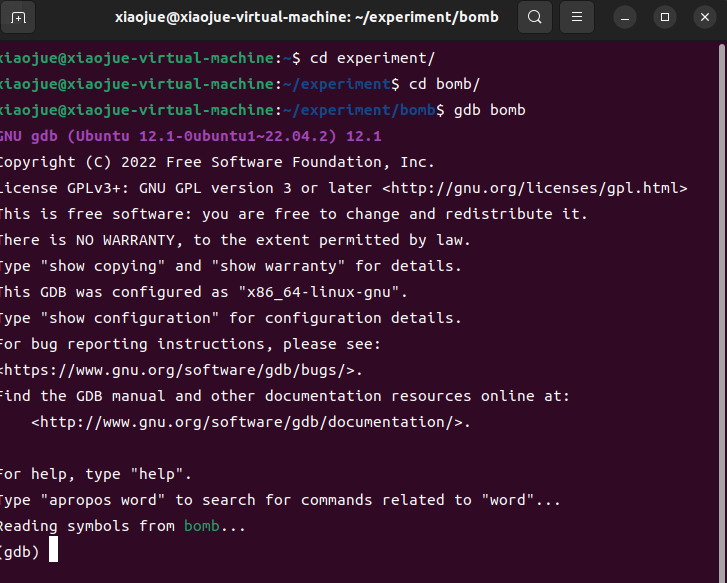
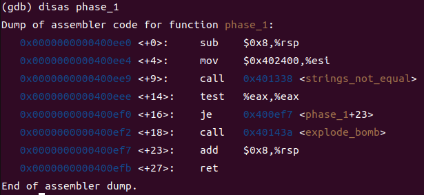
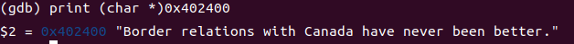
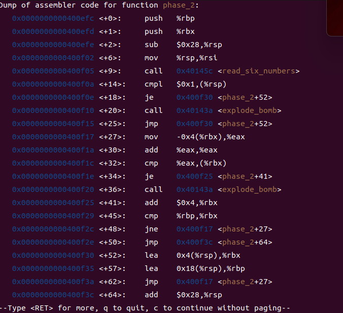
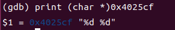

# 实验环境
虚拟机:VMware Workstation17

系统镜像: ubuntu-22.04.4-desktop-amd64.iso

GCC环境(gcc version):gcc (Ubuntu 11.4.0-1ubuntu1~22.04) 11.4.0

GBD : GNU gdb (Ubuntu 12.1-0ubuntu1~22.04.2) 12.1

vim版本 8.2.2121

实验包:bomb.tar

# 实验准备
下载实验包 : bomb.tar

对实验包进行解压

解压命令解析:
```
tar -xvf bomb.tar
-xvf 
x – 解压文件
v – 显示进度
f – 文件名
后面接着的是需要解压文件(压缩包)的名字
```

这个实验没有啥要提前阅读的
直接阅读bomb.c文件内容，简单翻译理解后发现
设置了6个炸弹
需要进行反汇编得到答案，从而输入答案拆掉炸弹

# 开始实验
# 第一个炸弹
```c
/* Do all sorts of secret stuff that makes the bomb harder to defuse. */
    initialize_bomb();

    printf("Welcome to my fiendish little bomb. You have 6 phases with\n");
    printf("which to blow yourself up. Have a nice day!\n");

    /* Hmm...  Six phases must be more secure than one phase! */
    input = read_line();             /* Get input                   */
    phase_1(input);                  /* Run the phase               */
    phase_defused();                 /* Drat!  They figured it out!
				      * Let me know how they did it. */
    printf("Phase 1 defused. How about the next one?\n");
```
首先是初始化了炸弹

然后欢迎我们，说有6个阶段，这里直接可以理解为6个炸弹好一些

第一个是先用``read_line()``函数读取一个字符串。
然后进入``phase_1()``函数，并且把我们的输入传进去。
如果通过了就说阶段被解决了。可以进入下一个

这里我们先直接用GDB调试器看看``phase_1()``函数做了什么

使用命令``gdb bomb``



第一步也是准备工作，使用GDB反汇编bomb可执行文件，进去后的界面如上图所示

接下来反汇编函数``phase_1()`` ， 使用命令``disas phase_1``



得到反汇编后的内容
```c
   0x0000000000400ee0 <+0>:	sub    $0x8,%rsp
   0x0000000000400ee4 <+4>:	mov    $0x402400,%esi
   0x0000000000400ee9 <+9>:	call   0x401338 <strings_not_equal>
   0x0000000000400eee <+14>:	test   %eax,%eax
   0x0000000000400ef0 <+16>:	je     0x400ef7 <phase_1+23>
   0x0000000000400ef2 <+18>:	call   0x40143a <explode_bomb>
   0x0000000000400ef7 <+23>:	add    $0x8,%rsp
   0x0000000000400efb <+27>:	ret   
```

将汇编语言稍微解读一番

```c
   0x0000000000400ee0 <+0>:	sub    $0x8,%rsp  //开辟8位空间
   0x0000000000400ee4 <+4>:	mov    $0x402400,%esi //将0x402400写入寄存器%esi
   0x0000000000400ee9 <+9>:	call   0x401338 <strings_not_equal> // 调用strings_not_equal函数
   0x0000000000400eee <+14>:	test   %eax,%eax //进行测试 寄存器eax（返回值）进行自己和自己按位且设置条件码
   0x0000000000400ef0 <+16>:	je     0x400ef7 <phase_1+23> // 如果返回值 等于 0 那么就跳转到<phase_1+23>
   0x0000000000400ef2 <+18>:	call   0x40143a <explode_bomb> //调用函数<explode_bomb>
   0x0000000000400ef7 <+23>:	add    $0x8,%rsp //释放空间
   0x0000000000400efb <+27>:	ret   //结束函数
```

简单解读后，其实就发现这函数做了一些简单操作

1. 将疑似是 地址的值0x402400 写入了第二个参数寄存器内并且调用了字符串比较函数
因为我们传入的第一个参数没被改变也没被放入栈中，所以很有可能就是我们输入的字符串和第二个参数/第二个参数地址中的内容进行字符串比较
2. 如果比较返回值不是0 那么就会引爆，函数是比较不相等，所以要不引爆炸弹，两个字符串必须相等

这么一来我们只需要看看0x402400空间里面放了什么东西即可

输入指令``print (char *)0x402400``，来打印0x402400的字符串就可以得到本次拆除炸弹的答案:``Border relations with Canada have never been better.``


# 第二个炸弹
```c
    /* The second phase is harder.  No one will ever figure out
     * how to defuse this... */
    input = read_line();
    phase_2(input);
    phase_defused();
    printf("That's number 2.  Keep going!\n");
```

依旧是输入一串字符串，然后进行答案测试
同理反编译``phase_2()``函数即可



```c
   0x0000000000400efc <+0>:	push   %rbp
   0x0000000000400efd <+1>:	push   %rbx
   0x0000000000400efe <+2>:	sub    $0x28,%rsp
   0x0000000000400f02 <+6>:	mov    %rsp,%rsi
   0x0000000000400f05 <+9>:	call   0x40145c <read_six_numbers>
   0x0000000000400f0a <+14>:	cmpl   $0x1,(%rsp)
   0x0000000000400f0e <+18>:	je     0x400f30 <phase_2+52>
   0x0000000000400f10 <+20>:	call   0x40143a <explode_bomb>
   0x0000000000400f15 <+25>:	jmp    0x400f30 <phase_2+52>
   0x0000000000400f17 <+27>:	mov    -0x4(%rbx),%eax
   0x0000000000400f1a <+30>:	add    %eax,%eax
   0x0000000000400f1c <+32>:	cmp    %eax,(%rbx)
   0x0000000000400f1e <+34>:	je     0x400f25 <phase_2+41>
   0x0000000000400f20 <+36>:	call   0x40143a <explode_bomb>
   0x0000000000400f25 <+41>:	add    $0x4,%rbx
   0x0000000000400f29 <+45>:	cmp    %rbp,%rbx
   0x0000000000400f2c <+48>:	jne    0x400f17 <phase_2+27>
   0x0000000000400f2e <+50>:	jmp    0x400f3c <phase_2+64>
   0x0000000000400f30 <+52>:	lea    0x4(%rsp),%rbx
   0x0000000000400f35 <+57>:	lea    0x18(%rsp),%rbp
   0x0000000000400f3a <+62>:	jmp    0x400f17 <phase_2+27>
   0x0000000000400f3c <+64>:	add    $0x28,%rsp
   0x0000000000400f40 <+68>:	pop    %rbx
   0x0000000000400f41 <+69>:	pop    %rbp
   0x0000000000400f42 <+70>:	ret    
```

将汇编语言稍微解读一番

解读反汇编放在最后，这里先讲一下对于这比较长的反汇编函数如何入手到解决出答案（自己的做题时候方法）：
1.注意到引爆炸弹的地方只有两个 <+20> 和 <+36>
那么就从这两行的前面入手

首先是<+20>前两行分别是``$0x1,(%rsp)``和``je     0x400f30 <phase_2+52>``
意思是将栈内第一个值和1进行比较，如果``M[R[%rsp]] - 0x1 == 0``那么就跳到<+52>行否则引爆炸弹
所以此时栈内第一个值一定是1

再看下一个引爆条件
```c
   0x0000000000400f17 <+27>:	mov    -0x4(%rbx),%eax // 注意寄存器%eax的值 是 -0x4(%rbx)
   0x0000000000400f1a <+30>:	add    %eax,%eax // 自加 （翻倍）
   0x0000000000400f1c <+32>:	cmp    %eax,(%rbx) //如果R[%eax] != M[R[%rsp]]炸弹引爆
   0x0000000000400f1e <+34>:	je     0x400f25 <phase_2+41> // 否则跳到 41行
   0x0000000000400f20 <+36>:	call   0x40143a <explode_bomb>
```
从这几行可以知道，2 * M[-0x4(%rbx)] == M[(%rbx)] , 简单来说这连续内存的前后是翻倍的效果

2. 注意处理字符串的方式

```c
   0x0000000000400efe <+2>:	sub    $0x28,%rsp
   0x0000000000400f02 <+6>:	mov    %rsp,%rsi
   0x0000000000400f05 <+9>:	call   0x40145c <read_six_numbers>
```
调用了函数``read_six_numbers()``,简洁明了，从字符串中读取了六个数字
所以答案肯定是6个数字

到这里基本上可以确定有六个数字，并且猜测这六个数字是依次倍数关系 ， 第一个数是 1
所以猜测答案为 ``1 2 4 8 16 32``

现在开始验证，验证实际上就需要从头到尾连起来读了

```c
   0x0000000000400efc <+0>:	push   %rbp
   0x0000000000400efd <+1>:	push   %rbx
   0x0000000000400efe <+2>:	sub    $0x28,%rsp // 开辟28位空间
   0x0000000000400f02 <+6>:	mov    %rsp,%rsi
   0x0000000000400f05 <+9>:	call   0x40145c <read_six_numbers> //读取6个数 ， 结合开辟的空间猜测是6个int
   0x0000000000400f0a <+14>:	cmpl   $0x1,(%rsp) // 栈内第一个数是 1
   0x0000000000400f0e <+18>:	je     0x400f30 <phase_2+52> // goto <+52>
   0x0000000000400f10 <+20>:	call   0x40143a <explode_bomb>
   0x0000000000400f15 <+25>:	jmp    0x400f30 <phase_2+52>
   0x0000000000400f17 <+27>:	mov    -0x4(%rbx),%eax // * （注意%rbx是0x4(%rbx)) 所以 %eax 是 (%rsp) 的内容了
   0x0000000000400f1a <+30>:	add    %eax,%eax // 翻倍 *
   0x0000000000400f1c <+32>:	cmp    %eax,(%rbx) //  * （注意%rbx是0x4(%rbx))
   0x0000000000400f1e <+34>:	je     0x400f25 <phase_2+41> // 结合来看就是(%rsp) * 2== 0x4(%rsp) 
   0x0000000000400f20 <+36>:	call   0x40143a <explode_bomb>
   0x0000000000400f25 <+41>:	add    $0x4,%rbx // 地址+4 ， 指针指向下一个数了
   0x0000000000400f29 <+45>:	cmp    %rbp,%rbx // 结合 %rbp 的高位地址 ，可以得出这是指针结束判断
   0x0000000000400f2c <+48>:	jne    0x400f17 <phase_2+27> //  如果指针没到结尾就继续加倍操作<+27>
   0x0000000000400f2e <+50>:	jmp    0x400f3c <phase_2+64>
   0x0000000000400f30 <+52>:	lea    0x4(%rsp),%rbx // 将0x4(%rsp)的地址给%rbx,也就说将栈内第二个值的地址给了%rbx
   0x0000000000400f35 <+57>:	lea    0x18(%rsp),%rbp // 将rbp 设置为 0x18(%rsp)的内存地址
   0x0000000000400f3a <+62>:	jmp    0x400f17 <phase_2+27> // goto <+27>
   0x0000000000400f3c <+64>:	add    $0x28,%rsp
   0x0000000000400f40 <+68>:	pop    %rbx
   0x0000000000400f41 <+69>:	pop    %rbp
   0x0000000000400f42 <+70>:	ret    
```

第一次读到 <+34> 就应该知道 第一个数是 1 第二个数是 2
<+41>到<+48>其实是指针往后移的效果

对应的C语言应该是
```c
void phase_2(char *input){
   int a[6];
   read_six_numbers(input , a);
   if(a[0] != 1)explode_bomb();
   for(int i=1;i<6;i++){
      if(a[i] != a[i-1] * 2;)explode_bomb();
   }
}
```
到此为止猜测正确，答案就是 ``1 2 4 8 16 32``

# 第三个炸弹
直接反编译``phase_3()``函数
汇编语言太长了就不截图了
```c
   0x0000000000400f43 <+0>:	sub    $0x18,%rsp
   0x0000000000400f47 <+4>:	lea    0xc(%rsp),%rcx
   0x0000000000400f4c <+9>:	lea    0x8(%rsp),%rdx
   0x0000000000400f51 <+14>:	mov    $0x4025cf,%esi
   0x0000000000400f56 <+19>:	mov    $0x0,%eax
   0x0000000000400f5b <+24>:	call   0x400bf0 <__isoc99_sscanf@plt>
   0x0000000000400f60 <+29>:	cmp    $0x1,%eax
   0x0000000000400f63 <+32>:	jg     0x400f6a <phase_3+39>
   0x0000000000400f65 <+34>:	call   0x40143a <explode_bomb>
   0x0000000000400f6a <+39>:	cmpl   $0x7,0x8(%rsp)
   0x0000000000400f6f <+44>:	ja     0x400fad <phase_3+106>
   0x0000000000400f71 <+46>:	mov    0x8(%rsp),%eax
   0x0000000000400f75 <+50>:	jmp    *0x402470(,%rax,8)
   0x0000000000400f7c <+57>:	mov    $0xcf,%eax
   0x0000000000400f81 <+62>:	jmp    0x400fbe <phase_3+123>
   0x0000000000400f83 <+64>:	mov    $0x2c3,%eax
   0x0000000000400f88 <+69>:	jmp    0x400fbe <phase_3+123>
   0x0000000000400f8a <+71>:	mov    $0x100,%eax
   0x0000000000400f8f <+76>:	jmp    0x400fbe <phase_3+123>
   0x0000000000400f91 <+78>:	mov    $0x185,%eax
   0x0000000000400f96 <+83>:	jmp    0x400fbe <phase_3+123>
   0x0000000000400f98 <+85>:	mov    $0xce,%eax
   0x0000000000400f9d <+90>:	jmp    0x400fbe <phase_3+123>
   0x0000000000400f9f <+92>:	mov    $0x2aa,%eax
   0x0000000000400fa4 <+97>:	jmp    0x400fbe <phase_3+123>
   0x0000000000400fa6 <+99>:	mov    $0x147,%eax
   0x0000000000400fab <+104>:	jmp    0x400fbe <phase_3+123>
   0x0000000000400fad <+106>:	call   0x40143a <explode_bomb>
   0x0000000000400fb2 <+111>:	mov    $0x0,%eax
   0x0000000000400fb7 <+116>:	jmp    0x400fbe <phase_3+123>
   0x0000000000400fb9 <+118>:	mov    $0x137,%eax
   0x0000000000400fbe <+123>:	cmp    0xc(%rsp),%eax
   0x0000000000400fc2 <+127>:	je     0x400fc9 <phase_3+134>
   0x0000000000400fc4 <+129>:	call   0x40143a <explode_bomb>
   0x0000000000400fc9 <+134>:	add    $0x18,%rsp
   0x0000000000400fcd <+138>:	ret 
```

首先看如果处理读进去的字符串
一眼发现<+24>调用了``sscanf()``函数，这是以字符串当一个流进行读取的，返回值是成功读取的个数。
在C语言中，sscanf函数的声明如下：
```c
int sscanf(const char *str, const char *format, ...)
```
这里重点是看第二个参数传入了什么
所以第一反应是反汇编查看%rsi寄存器存了什么
往前看``   0x0000000000400f51 <+14>:	mov    $0x4025cf,%esi``
这一行吧一个地址传入了%esi寄存器
将这个地址里的字符串进行查看


发现传入的是``"%d %d"``，也就是意味着我们进去的字符串变成了两个数字

